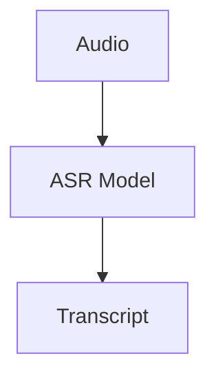
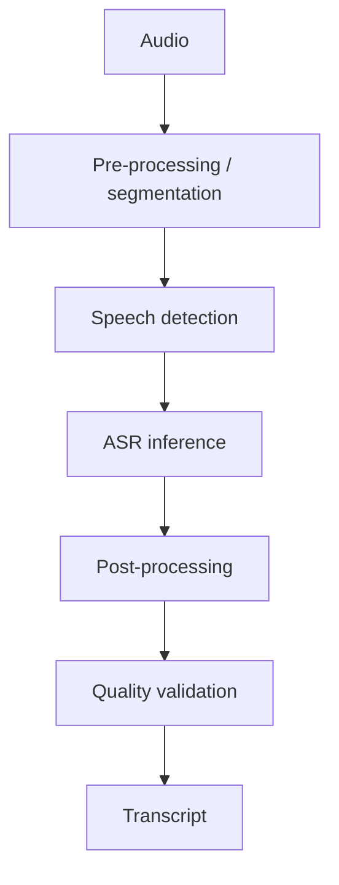

---

nodeId: asr-engine-migration
title: "When an ASR Migration Exposed a Reliability Problem"
description: "A real-world migration from a legacy speech recognizer to faster-whisper revealed that model replacement alone was not enough for reliable transcription."
type: case
status: exploring
publishedAt: 2026-08-10
topics: [asr-reliability, asr, whisper, reliability]
origin:
  kind: work
  disclosure: anonymized
evidence: [production_observation]
relations: []

---

## What happened

An existing speech-recognition pipeline was migrated from Vosk to `faster-whisper`.

At first, the migration looked straightforward: keep the existing audio input and downstream workflow, replace the ASR engine, and benefit from a stronger recognition model.

Realistic output evaluation showed that this mental model was incomplete.

Silence-heavy and low-information segments could sometimes produce fluent-looking text that was never present in the audio. Unlike an obvious transcription failure, hallucinated output could look valid enough to continue through downstream processing unnoticed.

The problem therefore changed from:

> Can `faster-whisper` replace Vosk?

to:

> What makes an ASR pipeline reliable enough that its output can actually be trusted?

## Why this became a knowledge branch

The migration exposed several questions beyond model selection:

* Why does Whisper hallucinate on some silence or low-information segments?
* What problem does Voice Activity Detection actually solve?
* How do chunking and segmentation affect transcription reliability?
* How should uncertain or suspicious output be handled?
* How should ASR quality be evaluated beyond manually checking a few samples?

This shifted my view of the system from:

to something closer to:

The ASR model is important, but reliability depends on the surrounding pipeline as well.

## What comes next

This case became the origin of several follow-up branches:

* **Research:** Why does Whisper hallucinate?
* **Experiment:** Does VAD reduce silence-induced hallucination?
* **Research:** How do chunking and decoding affect reliability?
* **Learning:** What does a production-ready ASR pipeline require?
* **Project idea:** Can suspicious transcription output be detected automatically?

The current working hypothesis is:

> **Model replacement is an implementation change; reliability is a system property.**

This is still an `exploring` case. The statement above should be validated through the research and experiments that follow.

---

> **Public note:** This engineering case is intentionally generalized. Company-specific architecture, data, metrics, business logic, and implementation details are excluded.
