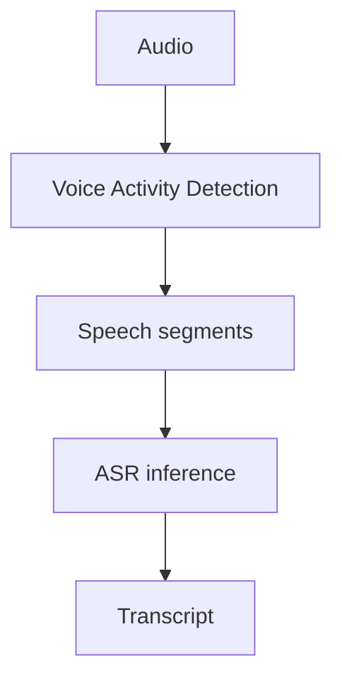

## Why I ran this experiment

During the migration to `faster-whisper`, I observed unsupported transcription on silence-heavy or low-information audio. The output could look plausible even though the input did not contain meaningful speech.

That observation led to a practical hypothesis:

> **If non-speech regions are filtered before ASR inference, this failure mode should occur less often.**

I introduced Voice Activity Detection (VAD) as a preprocessing step, then compared transcripts produced from actual audio before and after that change. The comparison was a manual engineering evaluation, not a controlled quantitative benchmark.

## What I observed

Before VAD, silence-heavy segments could produce text that was not supported by speech in the audio.

After introducing VAD, this failure mode occurred less often in the samples I manually evaluated. The practical result was useful enough that VAD became part of the implementation.

This observation also changed the system boundary I was reasoning about:

The recognizer was still important, but input handling affected the reliability of the final transcript.

## What I did not measure

I did not record a formal benchmark at the time. In particular, I did not produce:

- a hallucination-rate comparison;
- a WER comparison;
- a speech-recall or boundary-loss metric;
- a latency benchmark;
- or a statistically controlled evaluation across audio domains.

The evidence is therefore a qualitative production observation supported by a local before-and-after implementation experiment.

## What I can conclude

For the samples I evaluated during development, filtering non-speech regions made silence-induced unsupported transcription less apparent. VAD was useful enough in practical testing to retain as part of the solution.

This supports the narrower engineering learning that ASR reliability can depend on preprocessing and speech segmentation, not only on the selected recognition model. That learning is captured in [[asr-reliability-is-pipeline-problem]].

## What I cannot conclude

I cannot claim a quantified reduction in hallucination, that the chosen VAD configuration was optimal, or that the same result generalizes to every audio domain.

I also cannot conclude that VAD solves ASR hallucination as a whole. Unsupported text can still be influenced by segmentation boundaries, weak speech, decoding behavior, context carry-over, and post-inference decision logic.

## Future quantitative evaluation

A reproducible follow-up should preserve the same audio, model, and decoding configuration across direct-ASR and VAD-before-ASR paths. It should measure unsupported transcription, valid speech lost at boundaries, transcription quality, and latency.

The remaining measurement gap is tracked in [[measuring-asr-hallucination]].
