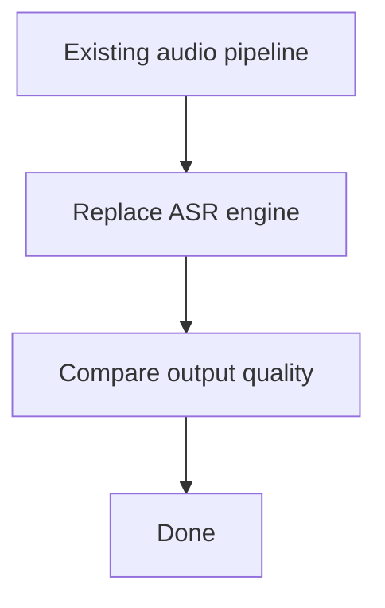
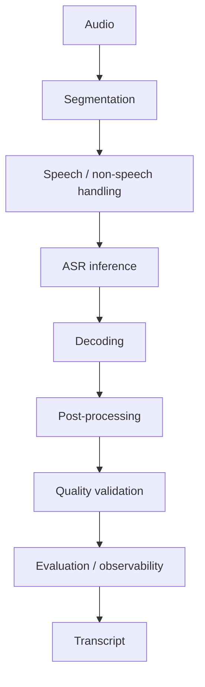
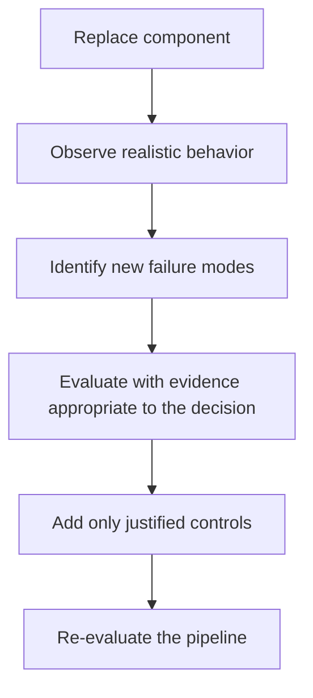

---

nodeId: asr-reliability-is-pipeline-problem
title: "ASR Reliability Is a Pipeline Problem"
description: "The current engineering understanding: production reliability emerges from segmentation, inference, validation, and evaluation—not model selection alone."
type: learning
status: learned
publishedAt: 2026-08-10
topics: [asr-reliability, asr, reliability, system-design]
parent:
  target: vad-hallucination-evaluation
  relation: derived_from
evidence: [production_observation, local_experiment]
relations:
  - type: inspires
    target: model-replacement-is-not-system-replacement

---

## Previous understanding

I originally thought an ASR migration could be treated mostly as an inference-layer replacement:

Under that model, the main engineering question was whether the new recognizer produced better transcription than the previous one.

The migration experience showed that this boundary was too narrow.

## What changed my understanding

The first important signal was not that the new model failed to run.

It was that realistic audio exposed failure modes that could not be explained by model selection alone.

Silence-heavy or low-information segments could produce unsupported text. That led to questions about speech detection, segmentation, decoding, and how the system decides whether a generated transcript should be trusted.

The [[whisper-hallucination]] research frames the same pattern. In the completed [[vad-hallucination-evaluation]] experiment, I introduced VAD and manually compared transcripts from actual audio before and after the change. Silence-induced unsupported transcription became less apparent in the samples I evaluated, so VAD was retained in the implementation.

This was a qualitative engineering evaluation rather than a controlled quantitative benchmark. It supports a pipeline-level learning without establishing a universal effect size:

> The quality of the final transcription depends on decisions made before, during, and after inference.

## Current understanding

I now think about ASR reliability as a pipeline property.

A simplified reliability boundary looks closer to:

Each stage can influence whether the final result is trustworthy.

For example:

* poor segmentation can create ambiguous inputs;
* weak speech detection can send meaningless audio into inference;
* decoding configuration can affect generated output;
* post-processing can hide or expose failure modes;
* missing quality checks can allow unsupported text to propagate;
* weak evaluation can make regressions difficult to detect.

The recognizer remains a critical component, but it is not the entire reliability boundary.

## The engineering implication

This does **not** mean every ASR system should contain every possible preprocessing, validation, or monitoring component.

Adding complexity without evidence would create a different engineering problem.

The important principle is:

> **The system boundary should expand only far enough to address failure modes that appear in realistic data.**

If silence-induced hallucination is observed, speech segmentation and no-speech handling become relevant.

If boundary speech is being lost, segmentation quality becomes relevant.

If suspicious output reaches downstream systems, validation becomes relevant.

If changes cannot be compared reliably, evaluation becomes relevant.

The architecture should follow observed failure modes rather than an abstract idea of what a "complete" ASR pipeline should contain.

## A better migration question

Instead of asking only:

> Is `faster-whisper` better than the previous recognizer?

I would now ask:

> Which failure modes change when the recognizer changes, and does the surrounding pipeline still handle them correctly?

That question leads to a more useful migration process:

## Current takeaway

Based on the production observation and qualitative VAD experiment, my current engineering understanding is:

> **ASR reliability is an emergent property of the pipeline, not a feature provided by the model alone.**

This is an engineering learning from the evaluated system, not a claim that VAD produces the same improvement in every domain. A formal benchmark would still be required to quantify the effect and test its generality.

That understanding leads to a broader takeaway captured in [[model-replacement-is-not-system-replacement]].
