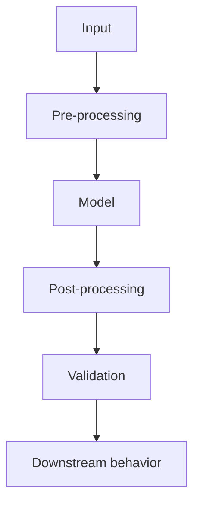

## Takeaway

Replacing a model can improve one component while simultaneously changing the failure modes of the surrounding system.

A migration is not complete simply because the new model runs successfully or produces better-looking output.

The relevant boundary is the behavior of the whole pipeline:

If the new component violates assumptions made elsewhere in that pipeline, the system can become less reliable even when the model itself is technically stronger.

This is what the ASR migration branch exposed: moving to a stronger recognizer did not remove the need to reason about silence handling, segmentation, validation, and evaluation.

## Reusable question

Whenever an AI or model-backed component is replaced, ask:

> **Which assumptions made by the surrounding system are no longer true?**

That question is usually more useful than asking only whether the new model performs better.

## Practical implication

A model migration should include at least three checks:

* **Behavior:** Which failure modes changed?
* **Boundary:** Which upstream or downstream assumptions depend on the old behavior?
* **Evidence:** How will the new behavior be measured under realistic inputs?

The broader principle is:

> **Component improvement does not automatically imply system improvement.**

This takeaway may inform a future tool for inspecting and comparing transcription quality, but that direction remains exploratory.
