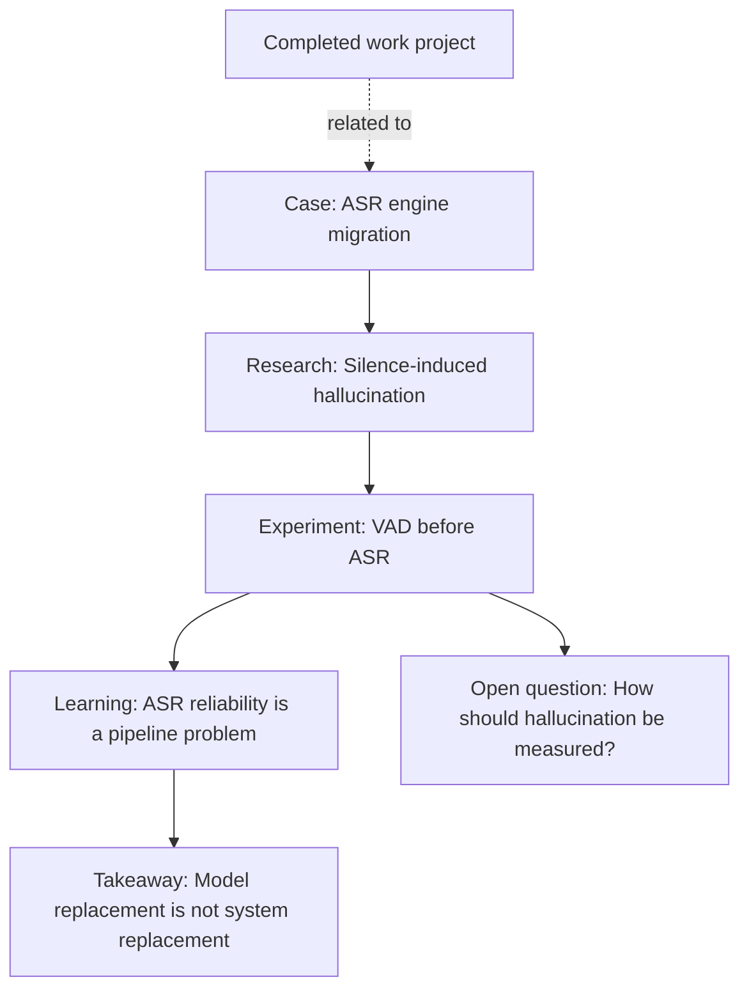

## Project context

This completed work project is one of the engineering contexts from which the ASR reliability knowledge branch emerged.

During development, migrating the recognition engine exposed unsupported transcription on silence-heavy audio. Investigating that behavior led to research about hallucination, a practical VAD experiment, a broader understanding of pipeline reliability, and an open question about quantitative measurement.

The project and the anonymized engineering case are parallel context nodes. Neither `project` nor `case` is a required root or endpoint for every knowledge branch.

## Publication boundary

This node records the project context at a deliberately general level. It does not document employer-specific architecture, internal metrics, business logic, data, or implementation details.

Only generalized engineering observations that can stand on their own are promoted into the public knowledge branch. The project node remains a private-source draft and is not published on the site.

## Knowledge that emerged

