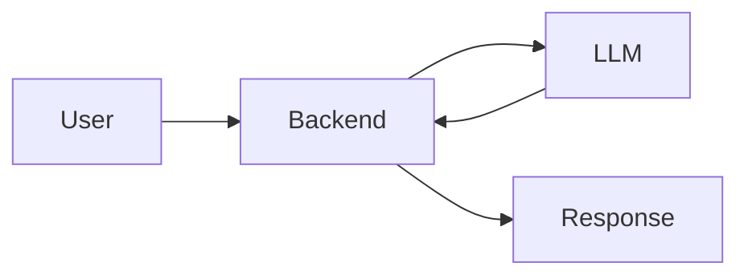
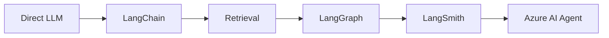

## What happened

The chatbot did not start as an agent system.

Its earliest architecture was intentionally simple:

At that stage, a direct model call was enough to prove the core interaction.

As the system evolved, the requirements changed.

The chatbot needed access to internal knowledge. Retrieval became part of the response path. As more processing stages were introduced, the workflow became harder to reason about as a single chain. Debugging also became harder because a poor final answer could originate from retrieval, routing, context construction, or generation rather than from one prompt alone.

The architecture eventually evolved through several stages:

This progression was not planned as a technology roadmap from the beginning.

Each additional layer appeared because the previous system boundary stopped being sufficient for the problems the chatbot needed to solve.

## Why this became a knowledge branch

Looking only at the final architecture hides the most useful part of the engineering story.

The interesting questions are not:

* Which framework is newer?
* Is LangGraph more advanced than LangChain?
* Is an agent platform better than a custom workflow?

The more useful questions are:

* When does retrieval become necessary?
* When does prompt tuning stop addressing the real problem?
* When should workflow state and routing become explicit?
* When does observability become part of the architecture?
* What changes when orchestration moves into a managed agent platform?

These questions became separate knowledge nodes because each represents a different architectural boundary.

---

> **Public note:** This case is intentionally generalized. Company-specific prompts, internal data, APIs, business rules, infrastructure details, and proprietary workflow logic are excluded.
