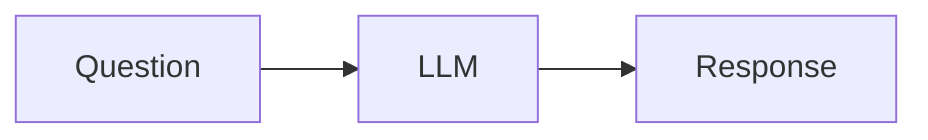
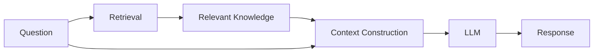

## Previous boundary

The earliest chatbot could be understood almost entirely through the model interaction:

If the answer was poor, the natural places to inspect were the prompt, model configuration, or generated response.

That mental model changed once the chatbot needed knowledge that could not reasonably live inside the prompt or be expected from the model itself.

## What retrieval changed

The response path became closer to:

Retrieval initially introduced a new capability, but it also introduced new failure modes.

A weak answer could now come from:

* poor retrieval;
* irrelevant documents;
* missing metadata;
* incorrect filtering;
* weak context construction;
* or generation after otherwise correct retrieval.

This changed the debugging boundary.

The model could behave correctly and still produce a weak answer because the evidence supplied to it was poor.

## Current understanding

Once retrieval becomes part of an AI system, response quality is no longer a model-only property.

The relevant system becomes:

> **Question → retrieval → context → generation → response**

Improving the model cannot compensate for every failure earlier in that path.

This also means retrieval should not be treated merely as a helper function attached to an LLM.

It becomes an independently observable component whose behavior needs to be inspected and evaluated.

## Engineering implication

When a grounded chatbot performs poorly, I now separate at least two questions:

> **Did the system retrieve the right evidence?**

and:

> **Did the model use that evidence correctly?**

Those are different failure modes and should not be debugged as if they were the same problem.
