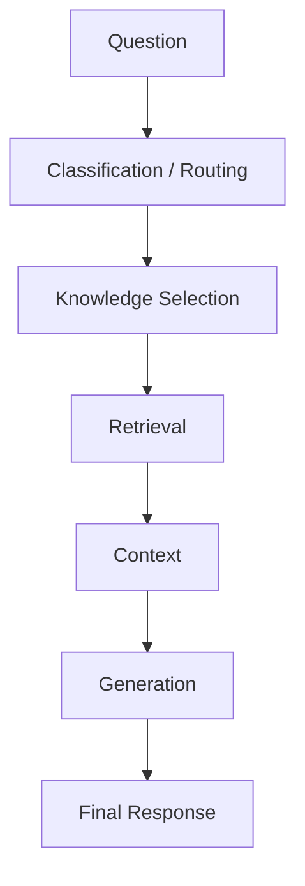
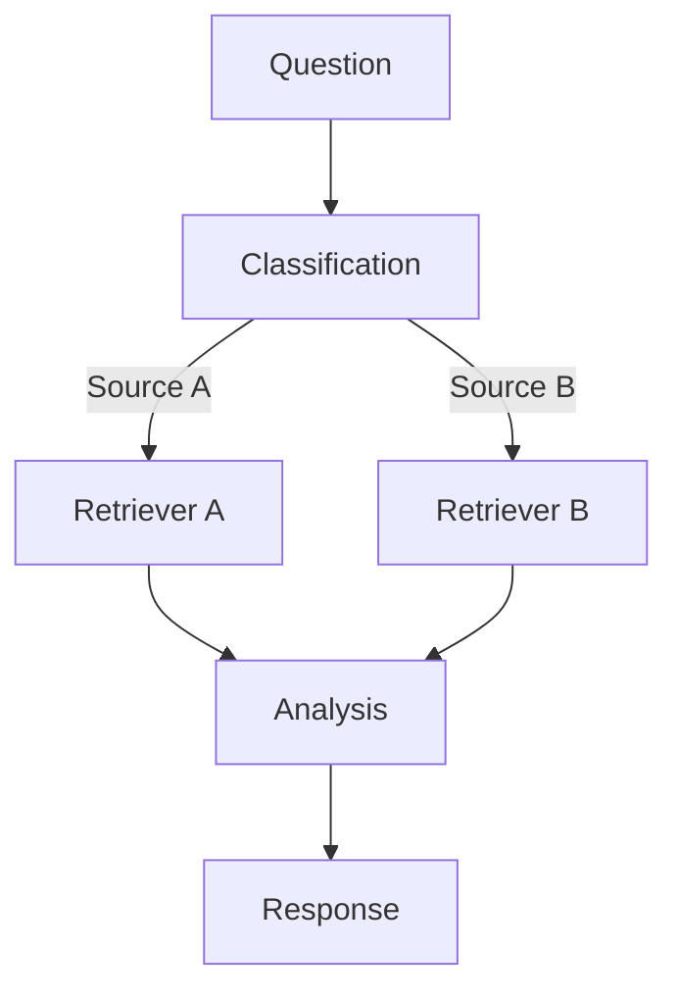

## The original response to quality problems

In a simple LLM workflow, prompt refinement is a reasonable first tool.

The relationship is relatively direct:

```text
Prompt
  ↓
Model
  ↓
Response
```

When the output is poor, changing the instructions can genuinely change the behavior that matters.

As the chatbot evolved, however, the final response stopped being produced by one interaction alone.

It increasingly depended on multiple intermediate decisions:



At that point, repeatedly adjusting the final prompt could improve some symptoms without making the underlying workflow easier to understand.

## The turning point

The important realization was:

> **Not every LLM quality problem is a prompt problem.**

If the wrong knowledge source was selected, prompt refinement at the generation stage would not fix routing.

If retrieval returned weak evidence, rewriting generation instructions would not fix retrieval.

If several hidden decisions contributed to the final response, looking only at the final prompt and output was no longer enough to explain the system.

I proposed introducing **LangGraph** to make the workflow explicit and **LangSmith** to make intermediate execution observable.

The purpose was not to introduce more AI tooling for its own sake.

The goal was to expose structure that had already become part of the system.

## Why LangGraph helped

A graph made responsibilities easier to separate conceptually:



Instead of treating everything as one increasingly complicated prompt flow, routing and processing stages could be reasoned about as explicit nodes and transitions.

## What changed in my thinking

Prompt engineering remains useful.

But once system behavior emerges from interactions between retrieval, routing, state, tools, and generation, prompt tuning becomes only one layer of debugging.

The broader principle became:

> **When the failure can originate from the workflow, the workflow itself needs to become explicit.**
