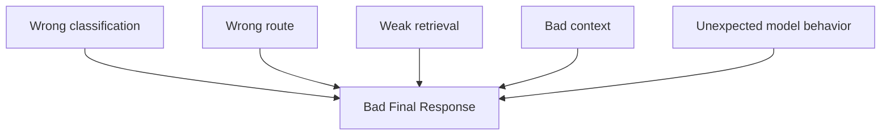

## The debugging problem

A simple model interaction is relatively easy to inspect:

```text
Input
  ↓
Model
  ↓
Output
```

Once the chatbot contained multiple intermediate stages, that stopped being true.

A poor final response could be caused by:



Looking only at the final answer could confirm that something went wrong.

It could not explain **where** it went wrong.

## Why tracing became necessary

This was one of the reasons I proposed introducing LangSmith alongside the LangGraph workflow.

The goal was to inspect execution as a sequence of observable steps rather than infer everything from the final output.

A useful trace should make questions like these answerable:

* Which workflow path was selected?
* What input entered each stage?
* What knowledge was retrieved?
* What context reached the model?
* Which intermediate result changed the next decision?
* Where did latency or failure accumulate?

This changes debugging from:

> The answer looks wrong. Which prompt should I change?

to:

> Which stage first diverged from the expected behavior?

## Current understanding

Observability requirements grow with hidden system behavior.

A one-step model call may require little more than request and response logging.

A multi-step AI workflow needs visibility into the decisions between those endpoints.

This is especially important because a final answer can look like a generation problem even when the root cause occurred much earlier.

## Engineering implication

Tracing should not be added only after an AI workflow becomes impossible to debug.

Once multiple hidden decisions materially influence the result, observability has already become an architectural concern.

The principle I took from this is:

> **If intermediate decisions affect correctness, intermediate decisions should be observable.**
