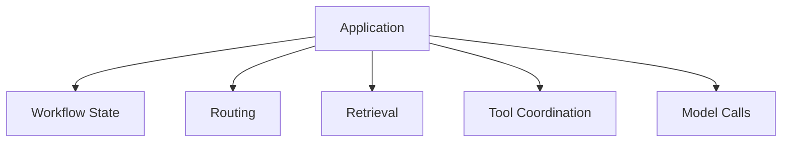
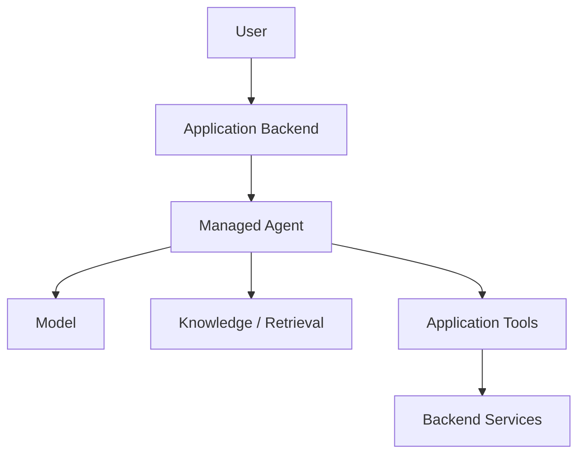

## This was not only a framework replacement

The later architecture moved from more application-managed orchestration toward Azure AI Agent.

At first glance, this can look like another technology migration:

```text
LangGraph
   ↓
Azure AI Agent
```

But the more important change was **ownership**.

In a custom orchestration model, much of the workflow lives directly inside the application:



With a managed agent platform, some of those responsibilities can move behind an agent boundary.



The application still exists.

Its responsibilities simply become more explicit.

## What remained important outside the agent

A managed agent can coordinate model interactions and tool usage, but not every application concern should automatically become agent-owned.

Deterministic responsibilities may still include:

* authorization;
* request validation;
* business rules;
* structured application APIs;
* data access boundaries;
* domain-specific transformations;
* failure handling that must behave predictably.

This became especially clear when application functionality was exposed to the agent through tools rather than embedded directly inside model instructions.

## Why this matters

Moving orchestration into a managed platform reduces some custom infrastructure, but it also introduces a new architectural question:

> **Where should the agent boundary end?**

Putting too little behind the agent may preserve unnecessary custom orchestration.

Putting too much behind it can make deterministic application behavior dependent on model-driven decisions.

## Current understanding

The useful distinction is not:

> Application or Agent?

It is closer to:

```text
Probabilistic coordination
        vs
Deterministic application behavior
```

The boundary between those two should be intentional.

This migration therefore changed how I think about agent adoption.

A managed agent platform is not the application architecture.

It is one architectural component inside it.
