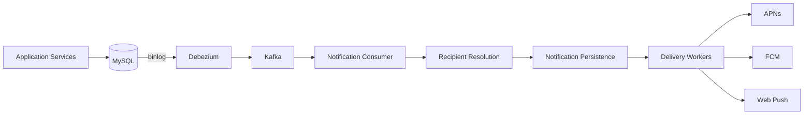
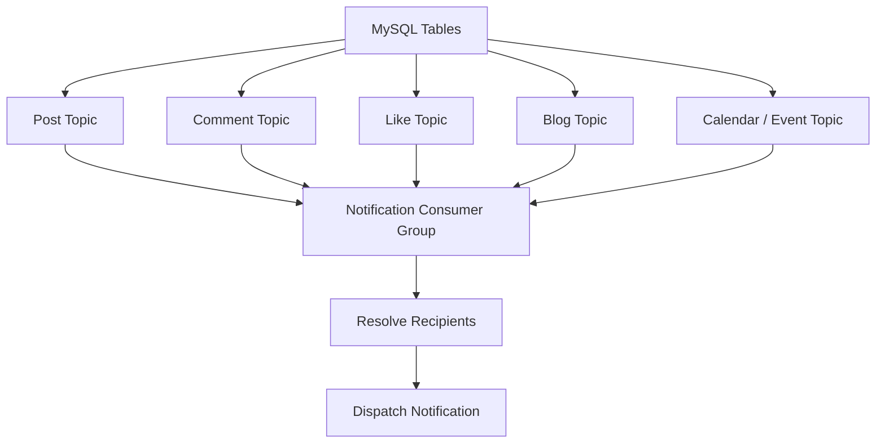

---

nodeId: notification-cdc-migration
title: "From Application Triggers to CDC-Driven Notifications"
description: "A notification system evolved from application-triggered jobs into a MySQL CDC pipeline built with Debezium and Kafka."
type: case
status: completed
publishedAt: 2026-08-11
topics: [event-driven-reliability, system-design, reliability, engineering-judgment]
origin:
    kind: work
    disclosure: anonymized
evidence: [production_observation]
relations: []
---

## What happened

The notification system originally depended more directly on application-side triggering.

At different stages, notification work was initiated through application APIs, asynchronous jobs, and polling-style processing.

That approach worked, but it created an important dependency:

> The application that changed business state also needed to remember that a notification should be triggered.

As the number of notification-producing actions grew, I moved the triggering boundary closer to the data itself.

The resulting architecture used MySQL row changes as the event source.



Instead of requiring every producer to explicitly call the notification service after changing data, Debezium observed selected MySQL tables through the binlog and published change events into Kafka.

The notification service then interpreted those events and decided whether a user-facing notification should exist.

## Event sources

Different business domains produced different event streams.

The implementation monitored tables associated with activities such as:

* posts;
* comments;
* likes;
* blogs;
* calendar-related events.

Each selected table was represented through a Kafka topic.

A consumer group subscribed to those event streams and routed each change according to its source domain.



The CDC event itself was not always enough to determine who should receive a notification.

The consumer still needed application context.

Depending on the event type, processing could involve reading the affected record and resolving users based on relationships such as subscriptions, following, mentions, or other domain rules.

CDC therefore became the **triggering mechanism**, not the entire notification business logic.

## Why the architecture changed

The main architectural change was this:

```text
Before

Business operation
      ↓
Application code
      ↓
Remember to trigger notification
```

became:

```text
After

Business operation
      ↓
Database state change
      ↓
CDC event
      ↓
Notification decision
```

That decoupled notification detection from the individual request path that produced the database change.

A service creating a post no longer needed to own the complete notification-delivery workflow.

The notification system could react independently to the state transition.

## What became harder

CDC removed one coupling, but introduced others.

The system now depended on:

* MySQL binlog availability;
* Debezium connector health;
* Kafka topic availability;
* consumer offsets;
* event ordering;
* duplicate or replayed events;
* recipient-resolution logic;
* downstream delivery workers.

This was an important shift in how I understood event-driven architecture.

The architecture became more decoupled, but not simpler in an absolute sense.

Complexity moved from synchronous application coordination into asynchronous infrastructure and failure recovery.

## Questions this case left behind

Several engineering questions emerged from the migration:

* When is a database change an appropriate domain event?
* What ordering guarantees does the notification system actually need?
* When should a Kafka offset be considered safe to commit?
* Where should recipient fan-out occur?
* How should replayed events be handled?
* Which failures require retry, and which require reconciliation?

Those questions became the rest of this knowledge branch.

---

> **Public note:** This case generalizes a completed work implementation. Internal schemas, service names, business rules, customer data, and deployment-specific identifiers are intentionally excluded.
