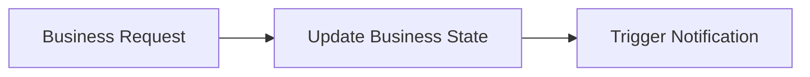
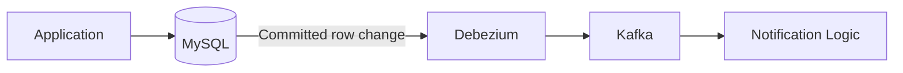

---

nodeId: why-cdc-replaced-application-triggers
title: "Why CDC Replaced Application-Triggered Notifications"
description: "Moving notification detection to database change events reduced producer coupling, but made asynchronous delivery and recovery first-class system concerns."
type: learning
status: applied
publishedAt: 2026-08-11
topics: [event-driven-reliability, system-design, reliability, engineering-judgment]
parent:
    target: notification-cdc-migration
    relation: derived_from
evidence: [production_observation]
relations: []
---

## Previous boundary

In an application-triggered notification design, the producer owns two responsibilities:



This is easy to understand.

It is also easy to couple.

Every code path capable of creating notification-worthy state must know:

1. that a notification exists;
2. when to trigger it;
3. which notification API or job to call;
4. how failure of that secondary operation should be handled.

As the number of event-producing features increases, that responsibility spreads through the application.

## What CDC changed

CDC changed the boundary from:

> "Tell the notification system that something happened."

to:

> "Observe that the state transition already happened."



The database became the observable source of committed changes.

That meant the request path no longer needed to synchronously coordinate notification triggering.

## What this solved

The strongest benefit was decoupling.

The producer could focus on its own state transition.

Notification processing became an independent consumer of that transition.

This also reduced the risk of creating two divergent outcomes such as:

```text
Business write succeeded
Notification trigger failed
```

because notification detection no longer depended on a second application call occurring successfully after the database operation.

## What this did not solve

CDC does not automatically create a perfect domain-event model.

A database row change describes **what changed in storage**.

A notification usually needs to understand **what that change means to the product**.

For example:

```text
row inserted
```

is a storage fact.

But:

```text
notify these users because a relevant post was created
```

is application meaning.

The consumer therefore still needed domain-specific routing and recipient-resolution logic.

## Current understanding

CDC is most useful here as a reliable observation boundary:

> **The database change tells the system that something happened; application logic still decides what that event means.**

This distinction matters.

Treating every row change as a fully formed business event would move too much domain interpretation into infrastructure.

Keeping all triggering inside the producer would preserve unnecessary coupling.

The design I arrived at sits between those extremes:

```text
Database change
      ↓
Reliable event detection
      ↓
Application-owned interpretation
      ↓
Notification behavior
```

## Engineering implication

CDC did not remove application logic.

It changed where that logic begins.

That led to a broader principle:

> **Decoupling the trigger does not eliminate the need for domain ownership.**
