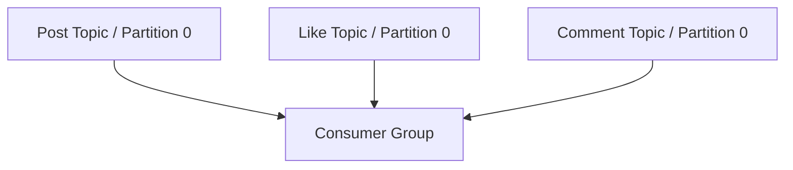

---

nodeId: kafka-ordering-boundary
title: "What Kafka Ordering Actually Guaranteed"
description: "Using one partition per notification event stream simplified ordering, but the guarantee remained local to each partition rather than global across the system."
type: learning
status: applied
publishedAt: 2026-08-11
topics: [event-driven-reliability, system-design, reliability, engineering-judgment]
parent:
    target: notification-cdc-migration
    relation: derived_from
evidence: [production_observation]
relations: []

---

## The requirement

Some notification events have an intuitive temporal relationship.

A system may observe:

```text
Post created
     ↓
Comment created
     ↓
Like created
```

or multiple updates to records belonging to the same domain.

When processing becomes asynchronous, it is easy to assume that using Kafka means events are simply "ordered."

That is too broad.

## The implementation boundary

The notification pipeline used one partition for each monitored topic.

That choice intentionally favored a simple ordering model over maximum parallelism within an individual event stream.


Within a partition, the consumer can observe records in offset order.

That made reasoning about processing order significantly easier.

## What this did not guarantee

The important limitation is that Kafka ordering belongs to a partition.

It is not automatically a global property.

If separate business tables publish into separate topics:



each partition has its own ordered sequence.

There is no inherent global ordering such as:

```text
post offset 10
must always be processed before
like offset 25
```

across independent partitions.

That means the real design question is not:

> Does Kafka preserve order?

It is:

> **Which events require a shared ordering boundary?**

## Why I accepted lower parallelism

Using a single partition limits parallel consumption for that topic.

That is a throughput trade-off.

But notification processing did not need infinite parallelism at every layer.

Maintaining a simpler processing model was valuable because the consumer also performed application work such as recipient resolution and downstream dispatch.

Increasing partition count would increase throughput potential, but would also require a clearer partitioning key and stronger reasoning about which events may safely execute concurrently.

## Current understanding

Ordering should be designed around a business boundary.

Examples of possible boundaries include:

```text
per aggregate
per user
per conversation
per entity
per domain stream
```

Kafka cannot choose that boundary for the application.

The partitioning strategy expresses it.

The reusable principle is:

> **Kafka preserves partition order. The application must decide whether partition order matches the ordering it actually needs.**
