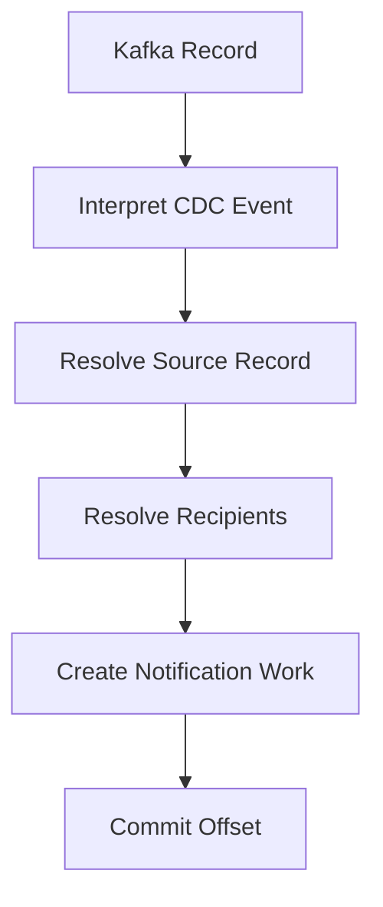

---

nodeId: manual-offset-processing-contract
title: "Why I Used Manual Kafka Offset Commits"
description: "Manual offset commits made the consumer's acknowledgement point an explicit part of notification processing rather than an automatic side effect of receiving a record."
type: learning
status: applied
publishedAt: 2026-08-11
topics: [event-driven-reliability, reliability, system-design, engineering-judgment]
parent:
    target: notification-cdc-migration
    relation: derived_from
evidence: [production_observation]
relations:
    - type: related_to
      target: kafka-ordering-boundary

---

## Receiving is not processing

A Kafka consumer can successfully receive an event long before the application has successfully handled it.

In the notification system, handling an event could involve several steps:



The important question was:

> **At which point can this record safely be acknowledged?**

If an offset advances too early, Kafka may consider the record consumed even though notification processing failed afterward.

## Why manual commit mattered

Manual offset commits made that acknowledgement boundary explicit.

Instead of:

```text
record received
      ↓
offset automatically advanced
      ↓
application processing
```

the intended relationship became closer to:

```text
record received
      ↓
application processing
      ↓
processing reaches accepted state
      ↓
commit offset
```

This does not make failures disappear.

It changes which failure mode is preferred.

Committing early risks **losing work**.

Committing later can result in **reprocessing work** after a crash or restart.

For notification systems, reprocessing is often easier to defend against than silently losing an event — provided downstream processing is designed for it.

## The hidden contract

The offset is therefore more than Kafka metadata.

It becomes part of the processing contract.

```text
offset not committed
≈
the system may need to process this record again
```

That has consequences for every downstream side effect.

If processing can be repeated, operations such as:

* creating notification records;
* creating delivery jobs;
* scheduling pushes;

must be considered under replay.

## What manual commit does not provide

Manual offset commit does not create exactly-once notification delivery.

A process can still fail in an awkward interval:

```text
side effect succeeded
        ↓
process crashed
        ↓
offset was not committed
        ↓
record delivered again
```

That creates the classic replay problem.

The offset strategy therefore cannot be evaluated independently from idempotency.

## Current understanding

A consumer acknowledgement should describe application progress, not merely message receipt.

The broader principle is:

> **Commit semantics should match the point at which the application is willing to repeat — or stop repeating — the work.**
