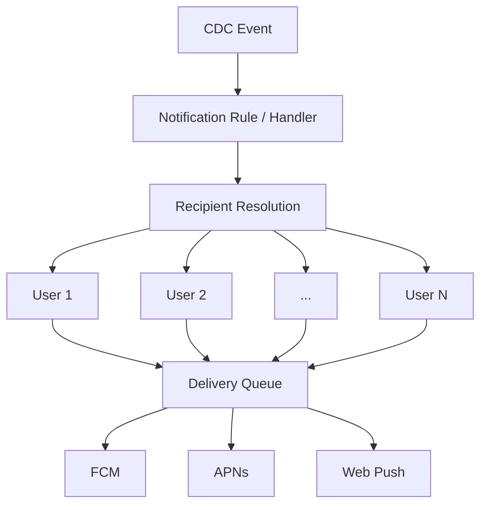

---

nodeId: notification-fanout-boundary
title: "Notification Fan-out Is a Separate System Problem"
description: "Detecting an event was only the beginning; recipient resolution and multi-channel fan-out created a second scaling and reliability boundary."
type: learning
status: applied
publishedAt: 2026-08-11
topics: [event-driven-reliability, system-design, reliability, engineering-judgment]
parent:
    target: notification-cdc-migration
    relation: derived_from
evidence: [production_observation]
relations: []
---

## An event is not a delivery

A CDC record answers a relatively narrow question:

> What database state changed?

A notification system has to answer much more:

> Who should know about it?

and then:

> How should each recipient be reached?

Those responsibilities create a separate system boundary.



## Recipient resolution

Different event domains required different recipient logic.

The consumer could not simply copy a user ID from the CDC payload and send one message.

Processing could depend on application relationships such as:

* who follows an entity;
* who belongs to a relevant group;
* who was mentioned;
* who subscribed to a channel;
* which users should be excluded.

That means recipient resolution remained application-owned logic even though event detection moved to CDC.

## Fan-out changes the scale

A single source event can become many delivery operations.

In the implementation, one post could fan out to thousands of recipients, with cases reaching roughly **7,000 recipients**.

That changes the performance problem from:

```text
1 database event
→
1 notification
```

to:

```text
1 database event
→
N recipients
→
N device/channel deliveries
```

The expensive part of the system may therefore be downstream of Kafka.

Kafka can deliver one event efficiently while recipient expansion and push delivery generate thousands of operations.

## Why I separated delivery workers

The notification consumer should not need to block on every external push provider.

The architecture therefore separated event interpretation from delivery execution.

Conceptually:

```text
Kafka event handling
       ↓
Determine notification work
       ↓
Persist / queue delivery
       ↓
Workers
       ↓
APNs / FCM / Web Push
```

That makes the boundaries clearer:

* Kafka consumption owns event progress;
* recipient resolution owns audience determination;
* delivery workers own interaction with push providers.

## Current understanding

Event throughput and delivery throughput are different metrics.

A notification architecture should therefore distinguish:

```text
events per second
recipients per event
deliveries per second
provider latency
delivery failure rate
```

A system can have low event volume and still experience high delivery load because fan-out multiplies work.

The reusable principle is:

> **In fan-out systems, the source-event rate is often not the real scaling variable.**
