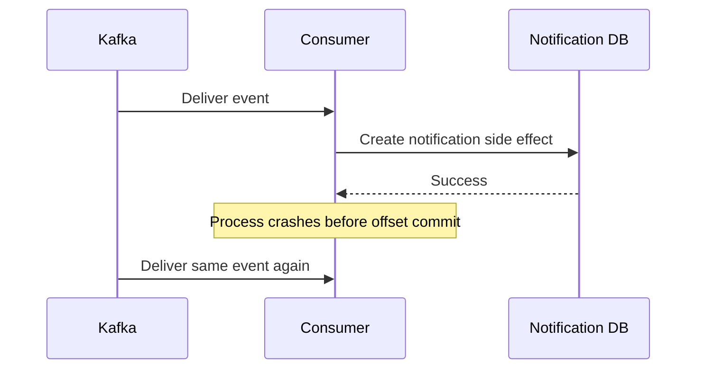

---

nodeId: cdc-idempotency-boundary
title: "Where Should Idempotency Live in a CDC Pipeline?"
description: "A reliability question about preventing replayed CDC events from producing duplicate application side effects."
type: research
status: exploring
publishedAt: 2026-08-11
topics: [event-driven-reliability, reliability, system-design, engineering-judgment]
parent:
    target: manual-offset-processing-contract
    relation: derived_from
evidence: [production_observation]
relations: []
---

## Research question

A CDC pipeline should assume that a record may be observed more than once.

Consider this sequence:



From Kafka's perspective, redelivery is reasonable.

From a user perspective, receiving the same push twice is not.

That creates the question:

> **Where should duplicate protection live?**

## Possible boundaries

There are several places where idempotency could theoretically be enforced.

### Event identity

A CDC event may contain enough information to identify a unique source change.

That identity could be propagated downstream and used to detect repeated processing.

### Notification persistence

Before creating a new notification record, the application could determine whether the same logical event has already produced one.

This moves idempotency into application state.

### Delivery layer

Individual push jobs could also carry stable identities so retried workers do not create logically new delivery attempts.

These boundaries solve related but different problems.

```text
CDC duplicate
        ↓
notification duplicate
        ↓
delivery duplicate
```

Preventing one does not automatically prevent all three.

## Why "exactly once" is not enough as a label

It is tempting to summarize the goal as:

> exactly-once processing.

But a notification pipeline crosses several systems:

```text
MySQL
→ Debezium
→ Kafka
→ Consumer
→ Notification DB
→ Queue
→ Push Provider
→ Device
```

A transport-level guarantee in one part of that chain cannot automatically create exactly-once user-visible behavior across every boundary.

The stronger question is:

> **Which side effect must be idempotent, and what stable identity can enforce that property?**

## What I would evaluate

A robust design should make replay tests explicit.

For example:

1. process an event normally;
2. replay the same Kafka record;
3. verify whether a second logical notification is created;
4. retry delivery work;
5. verify whether retry semantics match the intended user-visible behavior.

I would also distinguish:

```text
duplicate processing
duplicate notification record
duplicate push attempt
duplicate user-visible notification
```

These are not necessarily the same failure.

## Current working conclusion

Kafka replay should be treated as an expected execution path rather than an exceptional situation.

The broader principle is:

> **If a consumer commits after side effects, those side effects need an idempotency story.**

I am keeping this as Research rather than a finalized Takeaway because the correct idempotency boundary depends on the application's persistence and delivery semantics.
