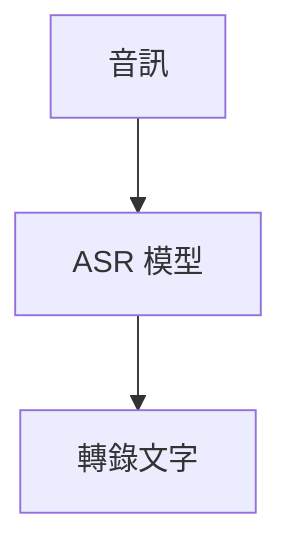
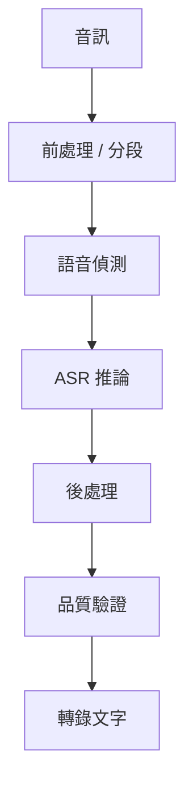

## 發生了什麼事

一套既有的語音辨識 pipeline 從 Vosk 遷移至 `faster-whisper`。

起初，這次遷移看起來很直接：保留既有的音訊輸入與下游流程、替換 ASR engine，再受益於更強的辨識模型。

但以接近真實情境的輸出進行評估後，我發現這個心智模型並不完整。

包含大量靜音或資訊量偏低的片段，有時會產生音訊中從未出現、卻讀起來流暢的文字。這種 hallucination 不像明顯的轉錄失敗，它看起來可能足夠合理，因而在未被察覺的情況下繼續流入下游處理。

因此，問題從：

> `faster-whisper` 能否取代 Vosk？

轉變為：

> 什麼條件能讓 ASR pipeline 足夠可靠，使它的輸出真正值得信任？

## 為什麼它發展成一條知識分支

這次遷移帶出了幾個超越模型選擇的問題：

* 為什麼 Whisper 會在部分靜音或低資訊片段產生 hallucination？
* Voice Activity Detection 實際解決的是什麼問題？
* chunking 與 segmentation 如何影響轉錄可靠性？
* 系統該如何處理不確定或可疑的輸出？
* 除了人工檢查少量樣本，還能如何評估 ASR 品質？

這讓我對系統的理解從：

轉變成更接近：

ASR 模型固然重要，但可靠性也取決於模型周圍的整條 pipeline。

## 接下來的發展

這個案例成為幾條後續分支的起點：

* **研究：** 為什麼 Whisper 會產生 hallucination？
* **實驗：** VAD 是否能減少靜音造成的 hallucination？
* **研究：** chunking 與 decoding 如何影響可靠性？
* **學習：** 可投入 production 的 ASR pipeline 需要具備什麼？
* **專案構想：** 能否自動偵測可疑的轉錄輸出？

目前的工作假設是：

> **替換模型是一項實作變更；可靠性則是整個系統的屬性。**

這個案例仍處於 `exploring` 狀態。上述論點仍需由後續研究與實驗驗證。

---

> **公開說明：** 這個工程案例已刻意泛化，不包含公司特定的架構、資料、指標、商業邏輯與實作細節。
