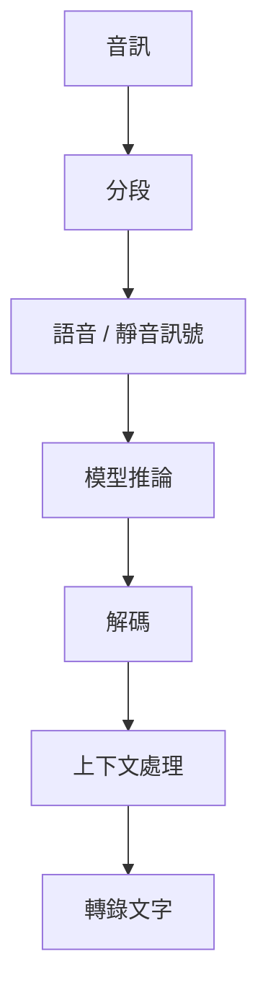

## 研究問題

為什麼靜音、背景噪音或微弱語音，會產生在語言上*看似合理*、實際卻沒有音訊依據的文字？

這個問題源於 [[asr-engine-migration]] 案例中觀察到的可靠性問題。

棘手之處在於，hallucination 的輸出不一定看起來有錯。它可能非常接近正常語言，足以讓下游系統將其當成有效的轉錄結果。

## 目前的理解模型

我目前認為，轉錄流程不該被簡化成：

```text
存在語音？
    ↓
是
    ↓
進行轉錄
```

實際的 pipeline 包含更多彼此影響的決策：



Whisper 系列模型仍然是在不確定性下進行序列生成。當音訊提供的證據很弱時，最終結果可能高度受到以下周邊因素影響：

* 音訊如何分段；
* 如何處理靜音或非語音區域；
* decoding 參數；
* `no_speech` 偵測等 threshold；
* 前文或 prompt；
* 輸入音訊的品質。

這表示 hallucination 可能並非由單一原因造成。

例如，與靜音相關的失敗可能源自推論前不恰當的分段、模型如何解讀模糊片段，或推論後接受生成文字的判斷邏輯。

## 為什麼這很重要

如果 pipeline 只檢查推論是否成功，就無法區分：

```text
有效的轉錄文字
```

與：

```text
看似合理但缺乏音訊依據的轉錄文字
```

因此，hallucination 是可靠性問題，不只是準確率問題。

系統可能需要生成文字以外的訊號，才能判斷某個片段該被信任、拒絕、重試，或標記供後續處理。

## 研究方向

我主要想理解以下幾個面向：

### 靜音與語音偵測

`no_speech_prob` 等訊號有多大幫助？什麼情況下應由 Voice Activity Detection 在一開始就阻止片段進入轉錄？

### 分段

過長的靜音區域、過短的 chunk，或選得不好的邊界，是否會提高 hallucination 發生的機率？

### 解碼

decoding 參數與 fallback 行為，對缺乏依據的文字生成有多大影響？

### 上下文

當目前的音訊資訊不足時，先前生成的文字或 prompt context 是否會影響輸出？

### 評估

只使用 WER 可能無法完整描述這種失敗模式。

hallucination 可能加入 reference audio 中從未存在的內容，因此評估也需要明確衡量錯誤轉錄或缺乏依據的文字。

## 仍待驗證的問題

* 哪些失敗模式主要由 segmentation 而非 decoding 所主導？
* VAD 能在多大程度上減少與靜音相關的 hallucination？
* 除了 WER，該如何衡量 hallucination rate？
* 哪些 no-speech 或 confidence threshold 在實務上有效？
* 哪些 threshold 能泛化至不同的音訊領域？
* previous context 對低資訊片段有多大影響？
* 哪些保護措施該放在推論前，哪些該放在推論後？

## 衍生實驗

第一個實務實驗先隔離一個變因：

> **透過 VAD 移除非語音區域，能否減少在大量靜音音訊中觀察到的 hallucination？**

這項定性的工程實驗記錄於 [[vad-hallucination-evaluation]]。在我人工評估的樣本中，缺乏依據的轉錄變得較不明顯，因此保留了 VAD；但當時並未透過正式 benchmark 量化改善幅度。

目前的工作結論刻意維持在有限範圍：

> **Hallucination 應被視為 pipeline 行為加以研究，而不該預設它只是模型本身的失敗。**

若要對效果大小或普遍性做出更強的主張，仍需要進一步的量化評估。
