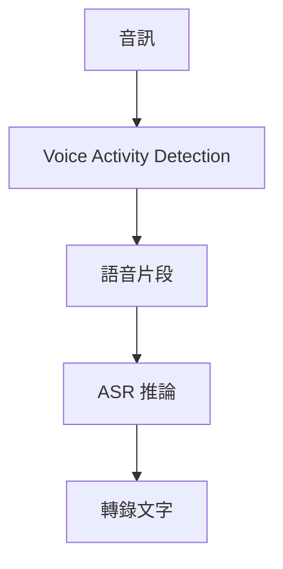

## 為什麼進行這項實驗

遷移至 `faster-whisper` 的過程中，我觀察到大量靜音或低資訊音訊會產生缺乏依據的轉錄。即使輸入不包含有意義的語音，輸出仍可能看似合理。

這項觀察形成了一個實務假設：

> **若在 ASR 推論前先過濾非語音區域，這種失敗模式應該會較少發生。**

我將 Voice Activity Detection（VAD）加入前處理，再比較實際音訊於調整前後產生的轉錄結果。這是人工進行的工程評估，而非受控的定量 benchmark。

## 我觀察到什麼

加入 VAD 前，包含大量靜音的片段可能產生沒有語音依據的文字。

加入 VAD 後，這種失敗模式在我人工評估的樣本中較少出現。實務結果帶來的改善足以讓 VAD 成為實作的一部分。

這項觀察也改變了我思考的系統邊界：

辨識器依然重要，但輸入處理也會影響最終轉錄結果的可靠性。

## 我沒有衡量什麼

當時我並未記錄正式 benchmark，尤其沒有產出：

- hallucination rate 的比較；
- WER 比較；
- speech recall 或 boundary loss 指標；
- latency benchmark；
- 跨音訊領域、具統計控制的評估。

因此，現有證據屬於定性的 production observation，並由本機實作的前後比較實驗加以支持。

## 我能得出什麼結論

對於開發期間評估的樣本，過濾非語音區域後，由靜音誘發且缺乏依據的轉錄變得較不明顯。VAD 在實務測試中的效用，足以讓它被保留為解決方案的一部分。

這支持了一項範圍較窄的工程理解：ASR 可靠性不只取決於所選的辨識模型，也可能受前處理與語音分段影響。這項理解記錄於 [[asr-reliability-is-pipeline-problem]]。

## 我不能得出什麼結論

我無法宣稱 hallucination 降低了多少、所選的 VAD 設定是最佳方案，或同樣的結果能泛化至所有音訊領域。

我也不能斷言 VAD 解決了所有 ASR hallucination。缺乏依據的文字仍可能受到分段邊界、微弱語音、decoding 行為、context carry-over 與推論後決策邏輯影響。

## 未來的定量評估

可重現的後續實驗應在 direct-ASR 與 VAD-before-ASR 兩條路徑中，使用相同的音訊、模型與 decoding 設定，並衡量缺乏依據的轉錄、邊界處遺失的有效語音、轉錄品質與 latency。

尚待補足的測量問題記錄於 [[measuring-asr-hallucination]]。
