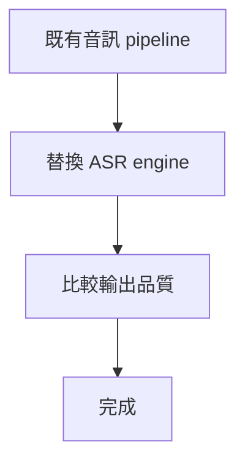
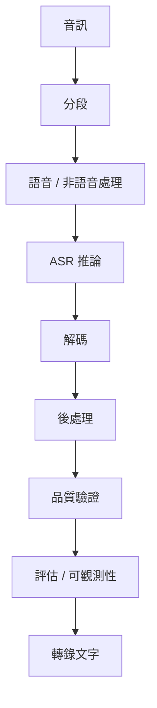
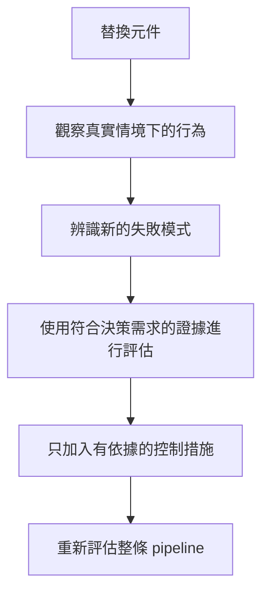

## 過去的理解

我原先認為 ASR 遷移大致可以視為替換 inference layer：

在這個模型下，主要的工程問題是：新的辨識器是否比舊有方案產出更好的轉錄？

但遷移經驗顯示，這個邊界過於狹窄。

## 什麼改變了我的理解

第一個重要訊號並不是新模型無法執行。

而是接近真實情境的音訊，暴露出無法只用模型選擇解釋的失敗模式。

包含大量靜音或資訊量偏低的片段可能產生缺乏依據的文字。這讓我開始思考語音偵測、分段、decoding，以及系統該如何判斷生成的轉錄是否值得信任。

[[whisper-hallucination]] 研究也描繪了相同的模式。在已完成的 [[vad-hallucination-evaluation]] 實驗中，我導入 VAD，並人工比較實際音訊在調整前後的轉錄結果。在我評估的樣本中，靜音誘發且缺乏依據的轉錄變得較不明顯，因此 VAD 被保留於實作中。

這是一項定性的工程評估，而非受控的定量 benchmark。它足以支持 pipeline 層級的學習，但無法建立普遍適用的效果大小：

> 最終轉錄品質取決於推論前、推論中與推論後所做的各項決策。

## 目前的理解

我現在將 ASR 可靠性視為整條 pipeline 的屬性。

簡化後的可靠性邊界更接近：

每個階段都可能影響最終結果是否值得信任。

例如：

* 不佳的分段可能產生模糊的輸入；
* 薄弱的語音偵測可能將無意義音訊送入推論；
* decoding 設定可能影響生成的輸出；
* 後處理可能隱藏或暴露失敗模式；
* 缺少品質檢查可能讓缺乏依據的文字繼續傳遞；
* 薄弱的評估機制可能讓 regression 難以被偵測。

辨識器仍是關鍵元件，但它並不等於完整的可靠性邊界。

## 工程上的含義

這**不表示**每套 ASR 系統都該加入所有可能的前處理、驗證或監控元件。

在沒有證據的情況下增加複雜度，會製造另一種工程問題。

重要原則是：

> **系統邊界只應擴展到足以處理真實資料中已出現的失敗模式。**

若觀察到靜音誘發的 hallucination，語音分段與 no-speech handling 就成為相關議題。

若邊界處的語音正在遺失，segmentation 品質就成為相關議題。

若可疑輸出會進入下游系統，validation 就成為相關議題。

若無法可靠比較變更前後的結果，evaluation 就成為相關議題。

架構應跟隨已觀察到的失敗模式，而不是抽象想像一條「完整」ASR pipeline 應該包含什麼。

## 更好的遷移問題

與其只問：

> `faster-whisper` 是否優於先前的辨識器？

我現在會問：

> 更換辨識器後，哪些失敗模式發生了變化？周圍的 pipeline 是否仍能正確處理它們？

這個問題會帶出更實用的遷移流程：

## 目前的結論

基於 production observation 與定性的 VAD 實驗，我目前的工程理解是：

> **ASR 可靠性是整條 pipeline 共同產生的屬性，而不是模型單獨提供的功能。**

這是從已評估系統中得到的工程學習，並不代表 VAD 在每個領域都能帶來相同改善。若要量化效果並驗證其普遍性，仍需要正式 benchmark。

這項理解進一步形成 [[model-replacement-is-not-system-replacement]] 所記錄的通用 takeaway。
