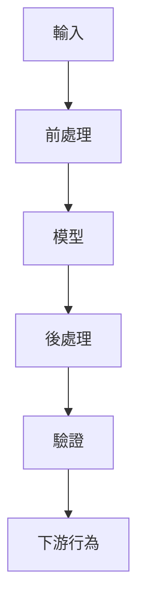

## 核心結論

替換模型可能改善單一元件，卻同時改變周圍系統的失敗模式。

新的模型能成功執行，或產生看起來更好的輸出，並不代表遷移已經完成。

真正相關的邊界是整條 pipeline 的行為：

如果新元件違反了 pipeline 其他部分原有的假設，即使模型本身在技術上更強，系統仍可能變得較不可靠。

這正是 ASR 遷移知識分支所揭露的事：採用更強的辨識器，並沒有消除思考靜音處理、分段、驗證與評估的必要性。

## 可重用的問題

每當替換 AI 或模型驅動的元件時，都應該問：

> **周圍系統原有的哪些假設，已經不再成立？**

這個問題通常比只問新模型是否表現更好更有幫助。

## 實務含義

一次模型遷移至少應包含三項檢查：

* **行為：** 哪些失敗模式改變了？
* **邊界：** 哪些上游或下游假設依賴舊有行為？
* **證據：** 如何在接近真實情境的輸入下衡量新行為？

更廣泛的原則是：

> **元件改善不會自動帶來系統改善。**

這項 takeaway 未來可能成為檢查與比較轉錄品質工具的依據，但這個方向仍處於探索階段。
