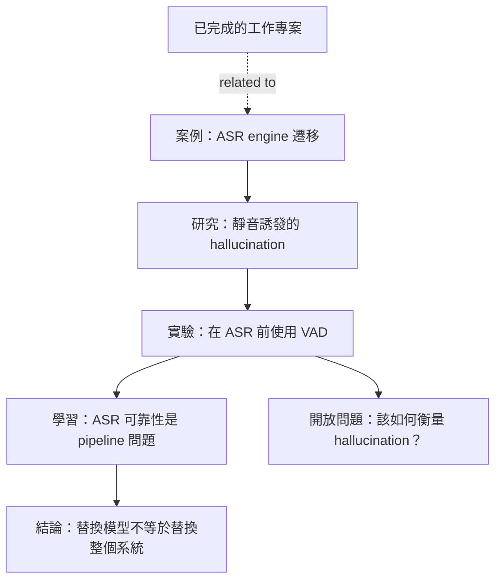

## 專案脈絡

這項已完成的工作專案，是 ASR 可靠性知識分支所源自的工程情境之一。

開發期間，替換辨識 engine 的工作暴露出大量靜音音訊會產生缺乏依據的轉錄。調查這項行為後，進一步發展出對 hallucination 的研究、實務 VAD 實驗、對 pipeline 可靠性更廣泛的理解，以及如何量化衡量結果的開放問題。

專案與匿名化工程案例是平行的情境節點。`project` 與 `case` 都不是每條知識分支必要的起點或終點。

## 公開邊界

這個節點刻意只以概括方式記錄專案脈絡，不包含雇主特定的架構、內部指標、商業邏輯、資料或實作細節。

只有能獨立成立、經過泛化的工程觀察，才會被提升至公開知識分支。這個專案節點仍是 private-source draft，不會發布於網站。

## 從中產生的知識

