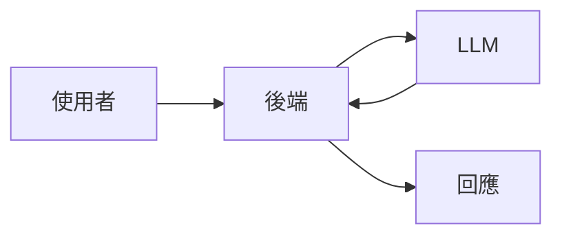
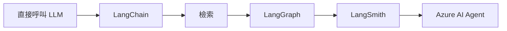

## 發生了什麼事

這個 Chatbot 一開始並不是 Agent 系統。

最早的架構刻意保持簡單：

在那個階段，直接呼叫模型已足以驗證核心互動。

隨著系統演進，需求也跟著改變。

Chatbot 需要存取內部知識，檢索因而成為回應路徑的一部分。處理階段增加後，整個工作流程也愈來愈難以視為單一鏈條來理解。除錯同樣變得困難，因為品質不佳的最終回答，可能源自檢索、路由、上下文建構或生成，而不再只是一個 prompt 的問題。

架構最後歷經了數個階段：

這個演進過程並不是一開始就規劃好的技術路線圖。

每一層新增的機制，都是因為先前的系統邊界已不足以處理 Chatbot 必須解決的問題。

## 為什麼這形成了一條知識分支

只看最終架構，反而會掩蓋這段工程經驗中最有價值的部分。

真正值得探討的問題並不是：

* 哪個框架比較新？
* LangGraph 是否比 LangChain 更進階？
* Agent 平台是否比自訂工作流程更好？

更有用的問題是：

* 什麼時候需要導入檢索？
* 什麼時候調整 prompt 已不再是在處理真正的問題？
* 什麼時候應該把工作流程的狀態與路由明確化？
* 什麼時候可觀測性會成為架構的一部分？
* 當 orchestration 移入受管理的 Agent 平台時，系統會發生什麼改變？

這些問題各自代表不同的架構邊界，因此成為獨立的知識節點。

---

> **公開說明：** 此案例已刻意泛化。公司特定的 prompt、內部資料、API、商業規則、基礎設施細節與專有工作流程邏輯均未包含在內。
