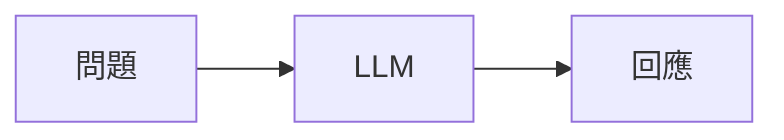
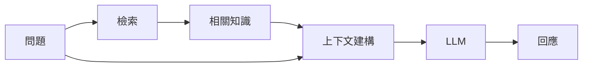

## 原本的系統邊界

最早的 Chatbot 幾乎可以完全透過模型互動來理解：

如果回答品質不佳，最自然的檢查位置會是 prompt、模型設定或生成的回應。

當 Chatbot 開始需要無法合理放進 prompt、也不能期待模型本身具備的知識時，這個思考模型便改變了。

## 檢索帶來的改變

回應路徑變得更接近：

檢索最初帶來的是新能力，但同時也引入新的失敗模式。

品質不佳的回答現在可能源自：

* 檢索品質不佳；
* 不相關的文件；
* 缺少 metadata；
* 錯誤的篩選條件；
* 薄弱的上下文建構；
* 或是在檢索正確之後，生成階段仍出了問題。

這改變了除錯的邊界。

即使模型本身運作正確，若提供給它的證據品質不佳，仍可能產生不理想的回答。

## 目前的理解

當檢索成為 AI 系統的一部分，回應品質就不再只由模型決定。

真正需要考量的系統變成：

> **問題 → 檢索 → 上下文 → 生成 → 回應**

改善模型無法補償這條路徑前段的每一種失敗。

這也表示，檢索不該只被視為附加在 LLM 上的一個輔助函式。

它會成為一個需要獨立觀察與評估的元件。

## 工程上的意義

當一個 grounded chatbot 表現不佳時，我現在至少會拆成兩個問題：

> **系統是否檢索到正確的證據？**

以及：

> **模型是否正確使用了這些證據？**

這是兩種不同的失敗模式，不該當成同一個問題來除錯。
