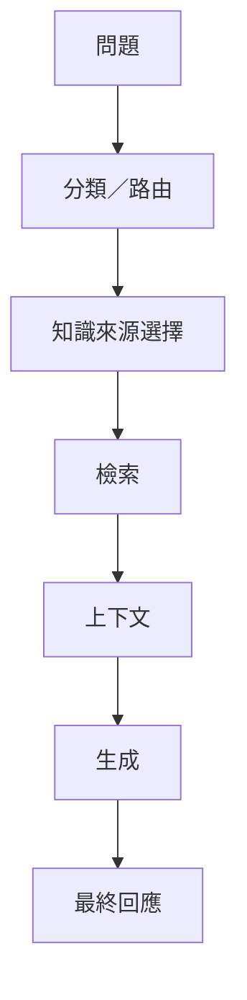
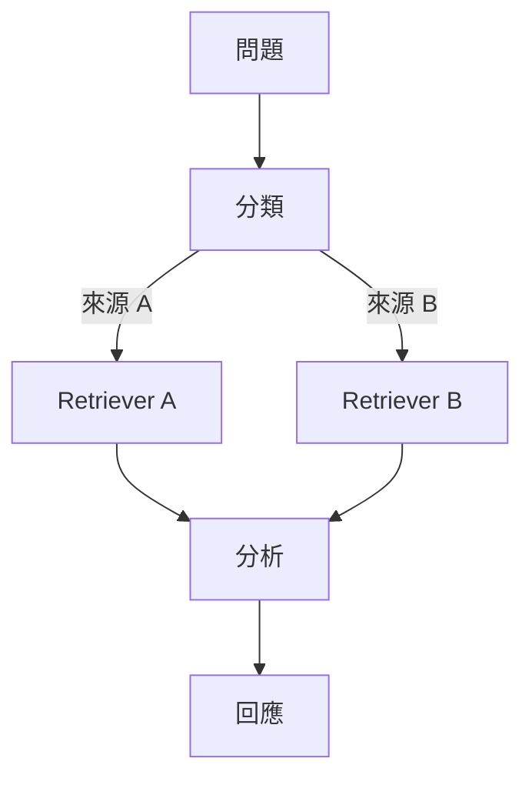

## 最初如何處理品質問題

在簡單的 LLM 工作流程中，調整 prompt 是合理的第一個工具。

兩者的關係相對直接：

```text
Prompt
  ↓
模型
  ↓
回應
```

當輸出品質不佳時，修改指令確實可能改變真正重要的系統行為。

然而，隨著 Chatbot 演進，最終回應已不再只由一次互動產生。

它愈來愈仰賴多個中間決策：



到了這個階段，反覆調整最後的 prompt 或許能改善部分症狀，卻無法讓底層工作流程變得更容易理解。

## 轉折點

關鍵的認知是：

> **並非每一個 LLM 品質問題都是 prompt 問題。**

如果系統選錯知識來源，調整生成階段的 prompt 無法修正路由。

如果檢索回傳的證據品質不佳，重寫生成指令也無法修正檢索。

如果最終回應受到數個隱藏決策共同影響，只看最後的 prompt 與輸出，已不足以解釋系統的行為。

我因此提議導入 **LangGraph**，讓工作流程明確化；並導入 **LangSmith**，讓中間執行過程可以被觀察。

目的並不是為了工具本身而增加更多 AI 工具。

真正的目標，是把已經存在於系統中的結構呈現出來。

## LangGraph 為什麼有幫助

圖狀流程讓不同責任在概念上更容易分離：



路由與處理階段可以被理解為明確的節點與轉換，不必再把所有行為視為一條愈來愈複雜的 prompt 流程。

## 我的想法如何改變

Prompt engineering 仍然有用。

但當系統行為來自檢索、路由、狀態、工具與生成之間的互動時，prompt tuning 就只是除錯的其中一層。

我最後形成的更廣泛原則是：

> **當失敗可能源自工作流程時，工作流程本身就必須被明確呈現。**
