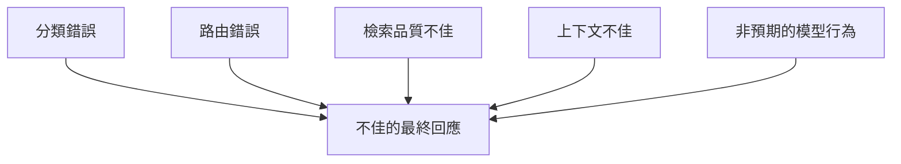

## 除錯問題

簡單的模型互動相對容易檢查：

```text
輸入
  ↓
模型
  ↓
輸出
```

當 Chatbot 包含多個中間階段後，情況就不再如此。

品質不佳的最終回應可能由下列原因造成：



只看最終答案，可以確認有事情出錯。

但無法解釋錯誤發生在**哪裡**。

## 為什麼需要 Tracing

這也是我提議在 LangGraph 工作流程旁導入 LangSmith 的原因之一。

目標是把執行過程當成一連串可觀察的步驟來檢查，而不是只從最終輸出反推一切。

一份有用的 trace 應該能回答這些問題：

* 系統選擇了哪一條工作流程路徑？
* 每個階段接收到什麼輸入？
* 系統檢索了哪些知識？
* 哪些上下文被傳入模型？
* 哪個中間結果改變了下一個決策？
* 延遲或失敗從哪個階段開始累積？

這讓除錯方式從：

> 回答看起來不對，我該修改哪一個 prompt？

轉變為：

> 哪個階段最先偏離了預期行為？

## 目前的理解

可觀測性的需求會隨著系統中的隱藏行為增加。

一步完成的模型呼叫，可能只需要記錄 request 與 response。

多步驟的 AI 工作流程，則需要看見這兩個端點之間的決策。

這點格外重要，因為即使根本原因發生在更早的階段，最終答案看起來仍可能像是生成問題。

## 工程上的意義

不該等到 AI 工作流程已經難以除錯時，才加入 tracing。

一旦多個隱藏決策開始實質影響結果，可觀測性就已成為架構議題。

我從中得到的原則是：

> **如果中間決策會影響正確性，那些中間決策就應該可以被觀察。**
