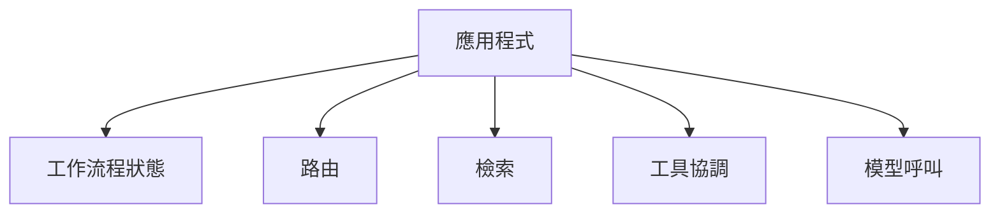
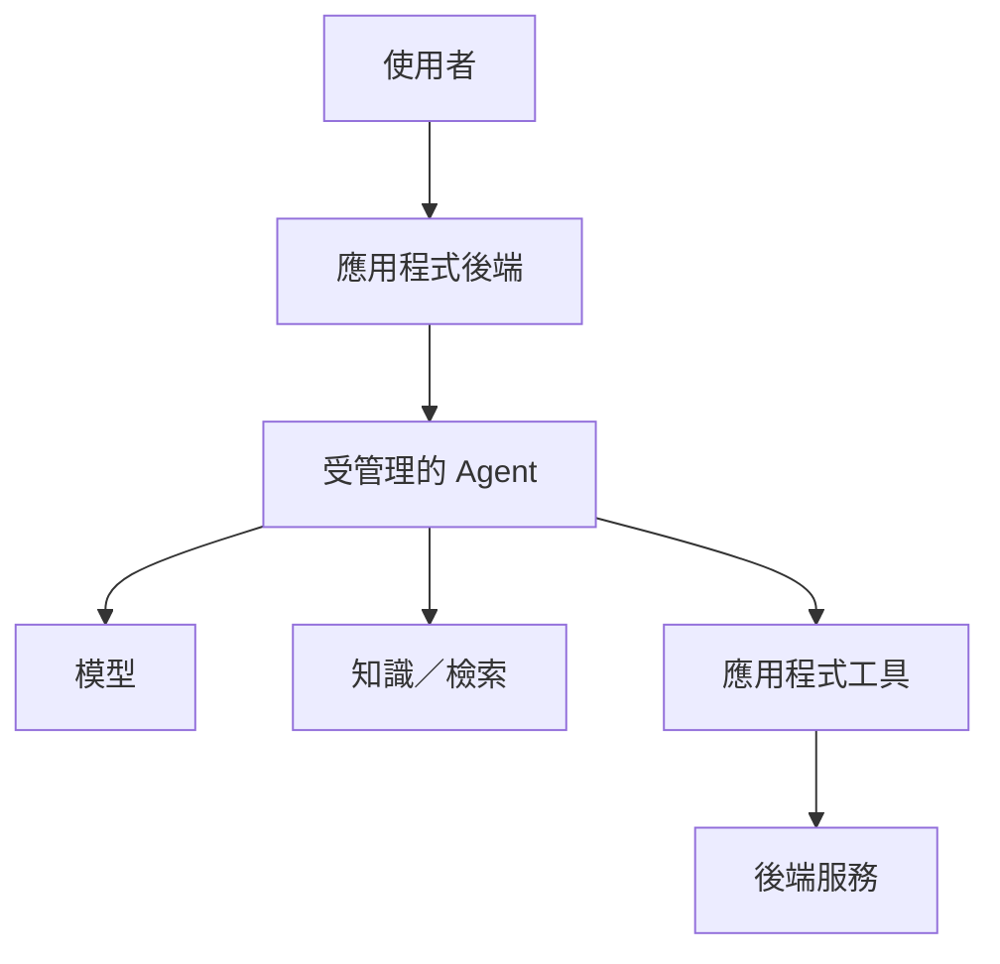

## 這不只是更換框架

後期架構從較多由應用程式管理的 orchestration，轉向 Azure AI Agent。

乍看之下，這可能只是另一次技術遷移：

```text
LangGraph
   ↓
Azure AI Agent
```

但更重要的變化其實是**責任歸屬**。

在自訂 orchestration 模型中，大部分工作流程直接存在於應用程式內：



使用受管理的 Agent 平台後，其中一部分責任可以移到 Agent 邊界之後。



應用程式依然存在。

只是它的責任變得更明確。

## Agent 之外仍然重要的責任

受管理的 Agent 可以協調模型互動與工具使用，但並非每一個應用程式議題都應自動交由 Agent 負責。

需要維持確定性的責任可能包括：

* 授權；
* request validation；
* 商業規則；
* 結構化的應用程式 API；
* 資料存取邊界；
* 特定領域的資料轉換；
* 必須以可預測方式運作的失敗處理。

當應用程式功能透過工具提供給 Agent，而不是直接寫進模型指令時，這一點變得格外清楚。

## 為什麼這很重要

將 orchestration 移入受管理的平台，可以減少部分自訂基礎設施，但也會帶來新的架構問題：

> **Agent 的邊界應該在哪裡結束？**

放進 Agent 的責任太少，可能會保留不必要的自訂 orchestration。

放進去的責任太多，則可能讓原本應具確定性的應用程式行為，依賴模型驅動的決策。

## 目前的理解

有用的區分並不是：

> 應用程式還是 Agent？

而是更接近：

```text
機率性的協調
        vs
具確定性的應用程式行為
```

兩者之間的邊界應該被有意識地設計。

因此，這次遷移也改變了我對採用 Agent 的看法。

受管理的 Agent 平台並不是整個應用程式架構。

它只是架構中的其中一個元件。
