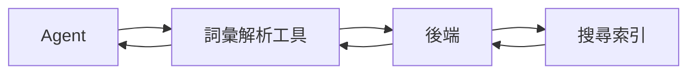

## 研究問題

Agent 系統通常至少有兩種方式可以存取領域資訊：

```text
知識檢索
```

或是：

```text
工具呼叫
```

兩者看起來可能很相似，因為最後都會把資訊提供給模型。

但從架構角度來看，它們提供的保證並不相同。

我想進一步釐清的問題是：

> **資訊何時應該維持為可搜尋的知識，何時又應該成為由應用程式管理的工具？**

## 一個實際案例

某項系統需求需要解析特定領域的術語。

其中一種做法，是把詞彙表文件放進 Agent 的可搜尋知識中，讓一般檢索機制找到相關定義。

另一種做法則是：



第二種設計需要更多應用程式程式碼，但它能回傳刻意設計的結構化 contract，而不只是任意檢索到的文字。

例如，一個 resolver 在概念上可以回傳：

```text
標準詞彙
定義
匹配類型
信心程度
來源
其他可能結果
```

而不只是一段可能相關的上下文。

## 目前的工作模型

我目前認為，下列情況更適合知識檢索：

* 資訊主要是描述性的；
* 模糊語意搜尋有幫助；
* 多份文件可能共同提供上下文；
* 模型需要的是資訊，而不是一項操作。

下列情況則可能更適合工具：

* 回應需要穩定的 schema；
* 應用程式端的 validation 很重要；
* 匹配規則需要受到控制；
* 結果需要可稽核；
* 必須納入具確定性的應用程式邏輯；
* 模型應該使用結果，而不是決定查詢如何運作。

## 取捨

把所有東西都轉成工具，會製造不必要的 API 與 orchestration。

把所有東西都當成知識檢索，則可能把重要的商業語意隱藏在機率性的搜尋行為中。

所以真正的問題不是：

> Tool 是否比 RAG 更好？

而是：

> **這條資訊存取路徑需要提供哪些保證？**

## 我仍想驗證的事情

* 哪些資訊類型最能從結構化工具 contract 中受益？
* 什麼時候工具帶來的延遲會超過額外控制的價值？
* 哪些檢索決策應該持續讓應用程式看得見？
* 在資訊抵達模型前，應該先進行多少具確定性的解析？
* 引用與來源追溯應該在哪一層強制執行？

目前，我把這視為一個架構邊界問題，而不是普遍適用的規則。
